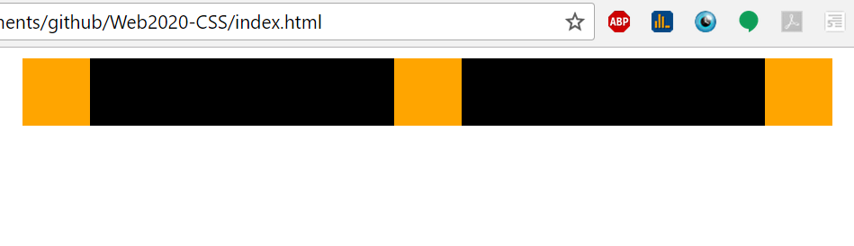
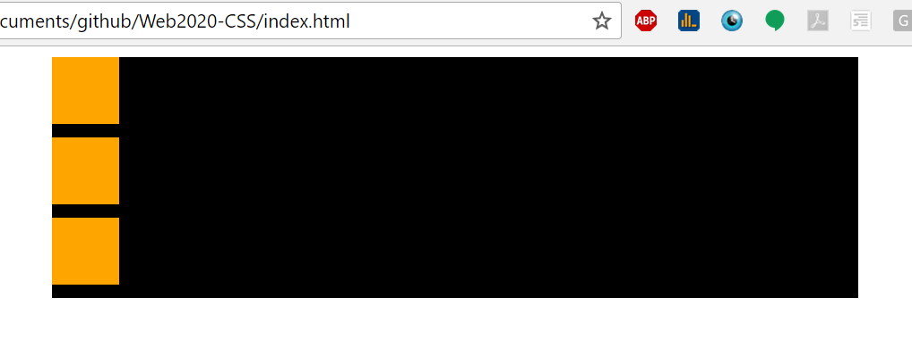
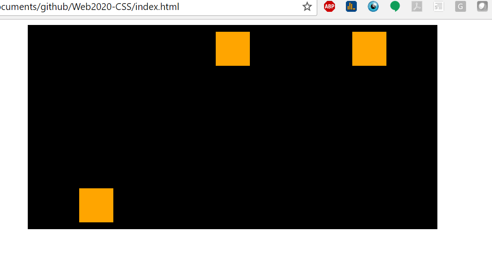
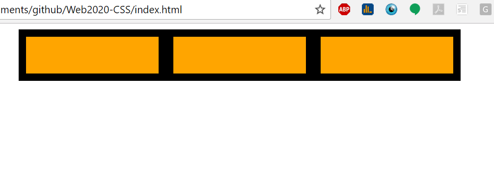

#Web2020 Exam 1

For questions 1 through 8, start with the following html and css:

```html
  <div class="cont">
    <div class="box"></div>
    <div class="box"></div>
    <div class="box"></div>
  </div>
```

```css
.cont{
  background-color: black;
  width: 600px;
  margin: 0 auto;
}
.box{
  width: 50px;
  height: 50px;
  background-color: orange;
}
```

###Question 1
Describe the simplest CSS changes required to create the following layout **using flexbox properties**:


To get the boxes to appear with space between the following changes need to be made 
.cont{
    background-color: black;
    width: 600px;
    margin: 0 auto;
    display: flex;
    flex-direction: row;
    justify-content: space-between;
  }


###Question 2
Describe the simplest CSS changes required to create the following layout **using flexbox properties**:


  to get the boxes to appear in column the following css changes need to be made 
 .cont{
   background-color: black;
   width: 600px;
   margin: 0 auto;
   display:flex;
   flex-flow: column wrap;
   justify-content: space-around;
}
.box{
    width: 50px;
    height: 50px;
    background-color: orange;
    margin: 10px;
    
  }

###Question 3
Describe the simplest CSS changes required to create the following layout **using flexbox properties**:


to center and put the boxes in a colum the following changes need to be made 
.cont{
   background-color: black;
   width: 600px;
   margin: 0 auto;
   display:flex;
   flex-direction: column;
   justify-content: space-around;
   align-items: center;
}
.box{
    width: 50px;
    height: 50px;
    background-color: orange;
    margin: 10px;
    
  }


###Question 4
Describe the simplest CSS changes required to create the following layout **using flexbox properties**:


to have all three boxes centered the following changes need to be made 
.cont{
   background-color: black;
   width: 600px;
   margin: 0 auto;
   display:flex;
   justify-content:center;
   flex-direction:row;
}
.box{
    width: 50px;
    height: 50px;
    background-color: orange;
    margin: 10px;    
  }

###Question 5
(Hint, give the container a height of 300px)
Describe the simplest CSS changes required to create the following layout **using flexbox properties**:


for the boxes to flex around like that you will need to make the following changes 
.cont{
  background-color: black;
  width: 600px;
  height: 300px;
  margin: 0 auto;
  display:flex;
  justify-content: center;
  flex-wrap: wrap;
}
.box{
   width: 50px;
   height: 50px;
   background-color: orange;
   margin: 10px;    
 }
 .box1{
   
  align-self: flex-end;
 }

###Question 6
(Hint, give the container a height of 300px)
Describe the simplest CSS changes required to create the following layout **using flexbox properties**:


To give the boxes space around and wrap around like that the following changes need to be made
.cont{
  background-color: black;
  width: 600px;
  margin: 0 auto;
  height: 300px;
  display:flex;
  justify-content:space-around;
  flex-direction:row;
}
.box{
   width: 50px;
   height: 50px;
   background-color: orange;
   margin: 10px;    
 }
 .box1{
   
  align-self: flex-end;
 }

###Question 7
Describe the simplest CSS changes required to create the following layout **using flexbox properties**:


in order for the boxes to have space around the following properties need to be added 

.cont{
  background-color: black;
  width: 600px;
  margin: 0 auto;
  display:flex;
  justify-content:space-around;
  flex-direction:row;
}
.box{
   width: 50px;
   height: 50px;
   background-color: orange;
   margin: 10px;    
 }

###Question 8
(Hint: requires the flex-grow or flex shorthand property)
Describe the simplest CSS changes required to create the following layout **using flexbox properties**:


to replicate this the following css changes need to be made

  .cont{
  background-color: black;
  width: 600px;
  margin: 0 auto;
  display:flex;
  justify-content:space-around;
  flex-direction:row;
}
.box{
   width: 50px;
   height: 50px;
   background-color: orange;
   margin: 10px;    
   flex-grow: 1;
 }
